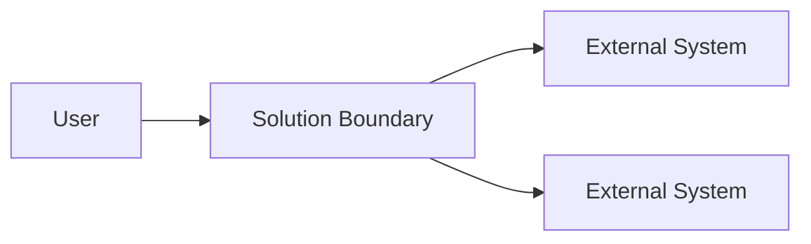
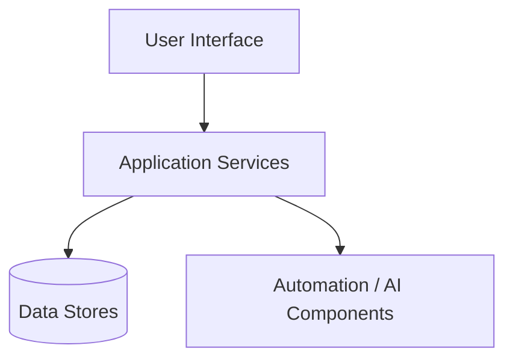
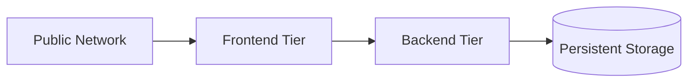
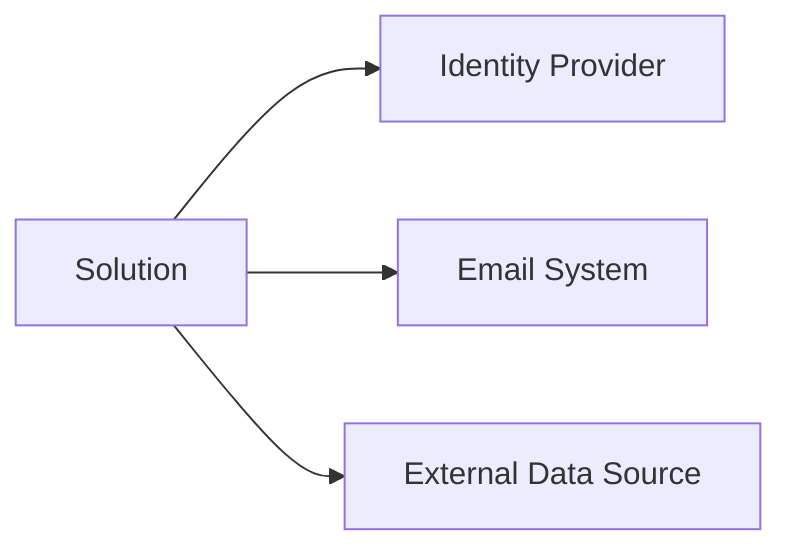
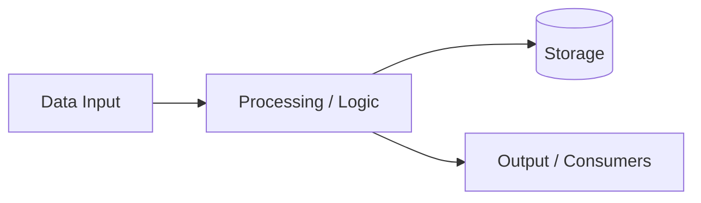

# Architecture Diagrams

> **Document ID:** 1C  
> **Document purpose**  
> This document provides visual representations of the solution architecture to support understanding of system structure, boundaries, and interactions.  
> It is intended for internal engineering, architecture, and technical stakeholders.

Diagrams in this document complement the Architecture Overview and are not a replacement for detailed design documentation.

---

## 1. Overview

This document contains the authoritative set of architecture diagrams for the solution.

Each diagram should:
- reflect the current state of the system
- clearly identify system boundaries
- avoid unnecessary implementation detail
- be kept in sync with architectural changes

---

## 2. Context diagram

The context diagram shows the solution in relation to users and external systems.

**Purpose:**  
- establish scope  
- identify external dependencies  
- clarify trust boundaries  

---

## 3. High-level system architecture diagram

This diagram illustrates major internal components and their relationships.

**Purpose:**  
- show primary component groupings  
- illustrate core interaction paths  

---

## 4. Deployment architecture diagram

This diagram shows how the system is deployed across environments or infrastructure layers.

**Purpose:**  
- illustrate deployment topology  
- clarify isolation and exposure  

---

## 5. Integration diagram

This diagram highlights integrations with external systems.

**Purpose:**  
- visualize integration points  
- support integration planning  

---

## 6. Data flow diagram (high level)

This diagram shows how data flows through the system.

**Purpose:**  
- show data movement  
- support data governance discussions  

---

## 7. Diagram standards and conventions

All diagrams should follow these conventions:

- clearly labeled components
- consistent naming across documents
- directional arrows indicating flow
- minimal text inside nodes
- legends included if symbols are used

---

## 8. Diagram maintenance

Document expectations for keeping diagrams current.

- **Update trigger:** {{Architecture change / Release / Unknown}}
- **Owner:** {{Role or Team}}
- **Review cadence:** {{Frequency or Unknown}}

---

## 9. Assumptions and open items

### Assumptions
- {{Assumption}}
- {{Assumption}}

### Open items / TODOs
- {{Diagram refinement}}
- {{Missing diagram}}

---

## 10. Summary

This document provides visual representations of the solution architecture to support shared understanding and technical alignment.

Detailed component behavior and configuration are documented elsewhere.
