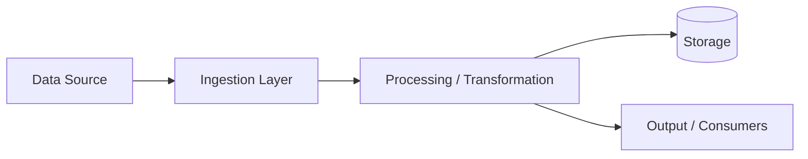

# Data Flow

> **Document ID:** 1E  
> **Document purpose**  
> This document describes how data moves through the solution, including major inputs, transformations, storage locations, and outputs.  
> It is intended for internal engineering, architecture, and technical stakeholders.

This document supports system understanding, troubleshooting, and governance discussions.

---

## 1. Overview

This document describes how the solution processes and moves data across components and integrations.

Data flow may include:
- user-driven data entry
- system-to-system integrations
- event-driven automation
- batch processing pipelines
- AI/automation processing

If data flows are not fully mapped, mark unknown areas as **TODO**.

---

## 2. Data sources

List known data sources feeding the solution.

| Source | Type | Description | Frequency | Status |
|--------|------|-------------|----------|--------|
| {{Source}} | {{API/File/Event/UI}} | {{Description}} | {{Frequency}} | {{Confirmed/TODO}} |
| {{Source}} | {{Type}} | {{Description}} | {{Frequency}} | {{Status}} |

---

## 3. Data sinks / outputs

List known destinations where data is written or delivered.

| Destination | Type | Description | Status |
|------------|------|-------------|--------|
| {{Destination}} | {{Database/API/File/Notification}} | {{Description}} | {{Confirmed/TODO}} |
| {{Destination}} | {{Type}} | {{Description}} | {{Status}} |

---

## 4. High-level data flow diagram

TODO: Replace placeholders with solution-specific components.

---

## 5. Primary data flows

Document key flows in the system.

---

### Flow: {{Flow name}}

#### Trigger
{{What triggers this flow? (user action, scheduled job, incoming event, etc.)}}

#### Input data
- {{Input type}}
- {{Input type}}

#### Processing steps
1. {{Step}}
2. {{Step}}
3. {{Step}}

#### Transformations
- {{Transformation}}
- {{Transformation}}

#### Storage
- {{Where data is stored}}
- {{Retention or lifecycle notes}}

#### Output
- {{Output type}}
- {{Output destination}}

#### Error handling
- {{Retry behavior}}
- {{Failure handling}}
- {{Dead-letter queue or fallback (if applicable)}}

#### Notes / TODOs
- {{Open item}}
- {{Open item}}

---

## 6. Data lineage considerations

Describe lineage and traceability at a high level.

- {{Where original source is tracked}}
- {{How transformations are recorded}}
- {{Audit logging approach}}

If lineage is not tracked, state **Data lineage tracking not defined**.

---

## 7. Security and privacy considerations

Describe security and privacy aspects of data flow.

- {{Encryption in transit}}
- {{Access control enforcement}}
- {{Sensitive data masking}}
- {{Logging redaction practices}}

---

## 8. Assumptions and open items

### Assumptions
- {{Assumption}}
- {{Assumption}}

### Open items / TODOs
- {{Unmapped data flow}}
- {{Unknown integration dependency}}

---

## 9. Summary

This document describes the major data flows through the solution.

Detailed schemas, retention, and processing logic are documented in Data Docs and Integration Docs.
