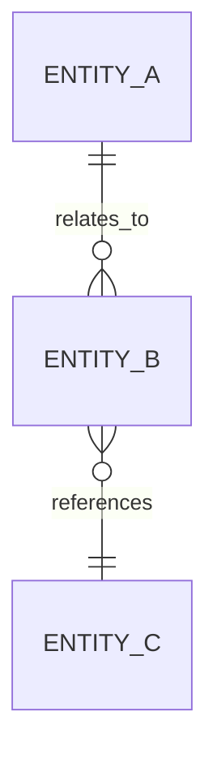

# Database Schema

> **Document ID:** 4A  
> **Document purpose**  
> This document describes the logical database schema used by the solution, including tables, relationships, and key constraints.  
> It is intended for internal engineering, data, and architecture stakeholders.

This document focuses on structure and intent rather than physical tuning details.

---

## 1. Overview

This document provides a structured view of how data is organized within the solution’s persistent storage layer.

If multiple databases or storage engines are used, document each separately.

---

## 2. Database overview

Describe the database at a high level.

- **Database type:** {{Relational / Document / Key-value / Unknown}}
- **Primary purpose:** {{Transactional / Analytical / Mixed}}
- **Deployment context:** {{Managed / Self-hosted / Unknown}}

Avoid naming specific products unless required for internal clarity.

---

## 3. Schema overview

Provide a high-level schema summary.

| Schema / Domain | Description | Notes |
|----------------|-------------|------|
| {{Schema}} | {{Description}} | {{Notes}} |
| {{Schema}} | {{Description}} | {{Notes}} |

---

## 4. Entity relationship overview

Describe major relationships.

Replace placeholders with solution-specific entities.

---

## 5. Table / collection inventory

List tables or collections.

| Name | Type | Purpose | Primary key | Notes |
|-----|------|---------|-------------|------|
| {{Table}} | {{Table/Collection}} | {{Purpose}} | {{PK}} | {{Notes}} |
| {{Table}} | {{Type}} | {{Purpose}} | {{PK}} | {{Notes}} |

---

## 6. Table definition template

Repeat this section for each major table or collection.

---

### Table / Collection: {{Name}}

#### Purpose
{{Describe what this table stores and why it exists.}}

#### Fields

| Field | Type | Required | Description |
|------|------|----------|-------------|
| {{field}} | {{type}} | {{Yes/No}} | {{Description}} |
| {{field}} | {{type}} | {{Yes/No}} | {{Description}} |

---

#### Keys and constraints

- **Primary key:** {{Field(s)}}
- **Foreign keys:** {{References}}
- **Unique constraints:** {{Description}}
- **Other constraints:** {{Description}}

---

#### Indexes (logical)

Describe important indexes at a logical level.

- {{Index purpose}}
- {{Index purpose}}

---

#### Relationships

Describe relationships to other entities.

- {{Related table}}
- {{Relationship type}}

---

#### Data lifecycle notes

Describe lifecycle considerations.

- {{Creation}}
- {{Update}}
- {{Deletion or archival}}

---

#### Notes / TODOs
- {{Open item}}
- {{Open item}}

---

## 7. Naming conventions

Document naming conventions.

- {{Table naming}}
- {{Field naming}}
- {{Schema naming}}

---

## 8. Assumptions and open items

### Assumptions
- {{Assumption}}
- {{Assumption}}

### Open items / TODOs
- {{Schema incomplete}}
- {{Relationship not finalized}}

---

## 9. Summary

This document describes the logical database schema used by the solution.

Detailed data definitions and semantics are provided in the Data Dictionary.
