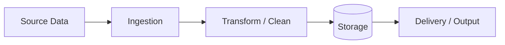

# Data Pipeline and ETL

> **Document ID:** 4D  
> **Document purpose**  
> This document describes data pipelines, ETL/ELT workflows, transformations, and operational controls used by the solution.  
> It is intended for internal engineering, data, and operations stakeholders.

This document supports data reliability, traceability, and maintainability.

---

## 1. Overview

This document describes how data is ingested, transformed, and delivered within the solution.

Pipelines may include:
- batch ingestion jobs
- streaming or event-driven processing
- scheduled exports
- analytics pipelines

If pipelines are still being identified, mark unknown areas as **TODO**.

---

## 2. Pipeline inventory

List known pipelines.

| Pipeline name | Type | Source | Destination | Frequency | Status |
|--------------|------|--------|-------------|----------|--------|
| {{Pipeline}} | {{Batch/Stream}} | {{Source}} | {{Destination}} | {{Frequency}} | {{Confirmed/TODO}} |
| {{Pipeline}} | {{Type}} | {{Source}} | {{Destination}} | {{Frequency}} | {{Status}} |

---

## 3. Pipeline architecture overview

Describe overall architecture.

Replace placeholders with real pipeline components.

---

## 4. Pipeline detail template

Repeat this section for each pipeline.

---

### Pipeline: {{Pipeline name}}

#### Purpose
{{Describe why this pipeline exists and what it supports.}}

#### Trigger
{{Scheduled / Event-driven / Manual / Unknown}}

#### Source systems
- {{Source}}
- {{Source}}

#### Destination systems
- {{Destination}}
- {{Destination}}

#### Transformations performed
1. {{Transformation}}
2. {{Transformation}}

#### Data validation
- {{Validation step}}
- {{Validation step}}

If validation is not implemented, state **Validation not implemented**.

#### Error handling
- {{Retry strategy}}
- {{Failure storage or dead-letter behavior}}
- {{Alerting approach}}

#### Monitoring and telemetry
- {{Pipeline success metric}}
- {{Pipeline latency metric}}

#### Data retention and cleanup
- {{Retention policy}}
- {{Cleanup approach}}

#### Security considerations
- {{Sensitive fields}}
- {{Access controls}}
- {{Encryption considerations}}

#### Notes / TODOs
- {{Open item}}
- {{Open item}}

---

## 5. Scheduling and orchestration

Describe how pipelines are scheduled.

- {{Scheduler or orchestrator}}
- {{Dependency sequencing}}
- {{Backfill approach}}

If orchestration is not formalized, state **Pipeline orchestration not standardized**.

---

## 6. Data quality and integrity controls

Describe data quality controls.

- {{Schema enforcement}}
- {{Duplicate detection}}
- {{Missing data handling}}

---

## 7. Operational considerations

Describe operational support.

- {{On-call responsibility}}
- {{Failure response expectations}}
- {{Reprocessing approach}}

---

## 8. Assumptions and open items

### Assumptions
- {{Assumption}}
- {{Assumption}}

### Open items / TODOs
- {{Pipeline undocumented}}
- {{Data quality rules pending}}

---

## 9. Summary

This document describes ETL and data pipeline workflows to support consistent ingestion, transformation, and delivery.

It should be updated as pipelines evolve or new sources are introduced.
