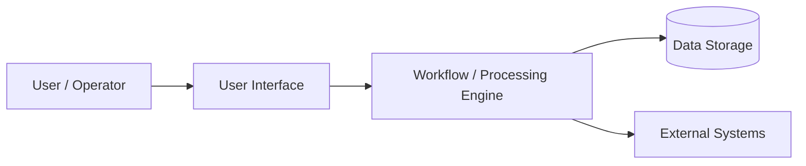

# Customer Architecture Overview

> **Document ID:** 8B  
> **Document purpose**  
> This document provides a customer-facing architecture overview of the solution, focused on conceptual components, integration points, and deployment models.  
> It is intended for customer technical stakeholders and solution architects.

This document avoids internal code-level details and avoids vendor product names unless required.

---

## 1. Overview

This document describes the architecture of the solution in a customer-facing format.

It focuses on:
- key functional components
- major data flows
- integration boundaries
- deployment model options

---

## 2. Architecture summary

Describe the solution architecture at a high level.

- {{High-level architecture summary}}
- {{High-level architecture summary}}

---

## 3. Major architecture components (conceptual)

Describe major components using generic terms.

| Component | Description | Customer relevance |
|----------|-------------|-------------------|
| User interface | {{Description}} | {{Relevance}} |
| Workflow engine | {{Description}} | {{Relevance}} |
| Data storage | {{Description}} | {{Relevance}} |
| Integration layer | {{Description}} | {{Relevance}} |
| Automation engine (if applicable) | {{Description}} | {{Relevance}} |

---

## 4. Architecture diagram (conceptual)

Provide a customer-friendly diagram.

Replace placeholders with solution-specific component names (generic, not vendor-specific).

---

## 5. Data flow overview

Describe major data flows.

- {{Data enters system}}
- {{Processing occurs}}
- {{Outputs delivered}}

Reference Customer Integration Guide for technical integration details.

---

## 6. Deployment model options

Describe supported deployment models.

| Deployment model | Description | Notes |
|-----------------|-------------|------|
| Customer-hosted | {{Description}} | {{Notes}} |
| Provider-hosted | {{Description}} | {{Notes}} |
| Hybrid | {{Description}} | {{Notes}} |

---

## 7. Environment overview

Describe environments.

- {{Development environment}}
- {{Test environment}}
- {{Production environment}}

If customers use only one environment, document it.

---

## 8. Integration boundaries

Describe boundaries between customer systems and the solution.

- {{Identity provider integration}}
- {{Email system integration}}
- {{Database or data warehouse integration}}
- {{Document storage integration}}

---

## 9. Security architecture summary

Describe security at a high level.

- {{Authentication}}
- {{Authorization}}
- {{Encryption}}
- {{Audit logging}}

Avoid claiming compliance or certification unless confirmed.

---

## 10. Customer responsibilities

Describe customer responsibilities.

- {{Network access}}
- {{User access management}}
- {{Integration configuration}}

---

## 11. Assumptions and open items

### Assumptions
- {{Assumption}}
- {{Assumption}}

### Open items / TODOs
- {{Diagram not finalized}}
- {{Deployment model decision pending}}

---

## 12. Summary

This document provides a customer-facing view of the solution architecture, including major components, deployment models, and integration boundaries.

Detailed integration configuration is provided in customer integration documentation.
