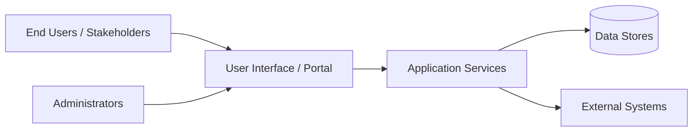

# Solution Overview

> **Document purpose**  
> This document provides a high-level, professional overview of the solution, intended for executives, stakeholders, customers, and technical leadership.  
> It explains *what the solution is*, *why it exists*, *what it does*, and *how it is architected*, without going into implementation-level detail.

---

## 1. Executive overview

This solution is designed to {{clearly state the primary mission and business purpose of the system}}.

At a high level, the solution enables {{describe the main capability or outcome}}, addressing {{the core problem or need}} for {{intended users or organizations}}.  
It serves as {{system role: e.g., a platform, service, application, integration layer}}, supporting {{key workflows or business functions}}.

If specific details are not present in the repository, clearly state **Unknown** and add a **TODO** rather than making assumptions.

---

## 2. Business purpose and objectives

The primary objectives of this solution are:

- {{Objective 1 — measurable or outcome-oriented}}
- {{Objective 2}}
- {{Objective 3}}

From a business perspective, the solution is intended to:

- Improve {{efficiency / visibility / compliance / security / service delivery}}
- Reduce {{risk / manual effort / operational overhead}}
- Enable {{scalability / modernization / automation}}

---

## 3. Scope of the solution

### In scope
The solution includes:

- {{Major functional area or capability}}
- {{Major functional area or capability}}
- {{Integrations or supporting services, if known}}

### Out of scope
The following are explicitly not part of this solution unless otherwise stated:

- {{Known exclusions}}
- {{Assumptions or dependencies on external systems}}

---

## 4. Functional overview

From an end-to-end perspective, the solution provides the following core functionality:

1. **{{Functionality name}}**  
   {{Narrative description of what this capability does and why it matters}}

2. **{{Functionality name}}**  
   {{Narrative description}}

3. **{{Functionality name}}**  
   {{Narrative description}}

Avoid low-level technical details. Focus on *what the system does*, not *how it is coded*.

---

## 5. High-level architecture

### Architectural approach

The solution follows a {{architectural style, e.g., layered, service-oriented, event-driven}} architecture designed to support:

- Maintainability
- Scalability
- Security
- Clear separation of concerns

### System context diagram

> If specific components cannot be confirmed from the repository, label them as **Generic** and note a TODO.

---

## 6. Major components

### User-facing components
- {{UI / portal / interface description}}

### Application services
- {{Backend services, APIs, workflows}}

### Data layer
- {{Databases, file storage, or data services — if known}}

### Integrations
- {{External systems or services — if known}}

---

## 7. Deployment and environments

The solution is expected to operate across the following environments:

- **Development:** {{Purpose / audience}}
- **Testing / QA:** {{Purpose / audience}}
- **Production:** {{Purpose / audience}}

If environment details are not present in the repository, state **Unknown** and add a TODO.

---

## 8. Release history

| Release | Date | Description |
|-------|------|-------------|
| v0.1 | {{YYYY-MM-DD or Unknown}} | Initial development / proof of concept |
| v1.0 | {{YYYY-MM-DD or Unknown}} | First production-ready release |
| vNext | {{Planned or Unknown}} | Planned enhancements |

> Only include releases that can be inferred from repository history, tags, or documentation.  
> Do not invent dates.

---

## 9. Roadmap (high level)

Planned or anticipated future enhancements may include:

- {{Planned capability or improvement}}
- {{Planned capability or improvement}}
- {{Planned capability or improvement}}

If no roadmap information exists, state **Roadmap not defined**.

---

## 10. Key assumptions and open items

### Assumptions
- {{Assumption clearly stated}}
- {{Assumption clearly stated}}

### Open questions / TODOs
- {{Open question}}
- {{Open question}}

---

## 11. Summary

In summary, this solution provides {{concise restatement of value and purpose}}.  
It is positioned to support {{business or operational goals}}, with an architecture designed for {{key qualities such as scalability, security, or maintainability}}.

Further detail is provided in the accompanying architecture, developer, and customer documents.
